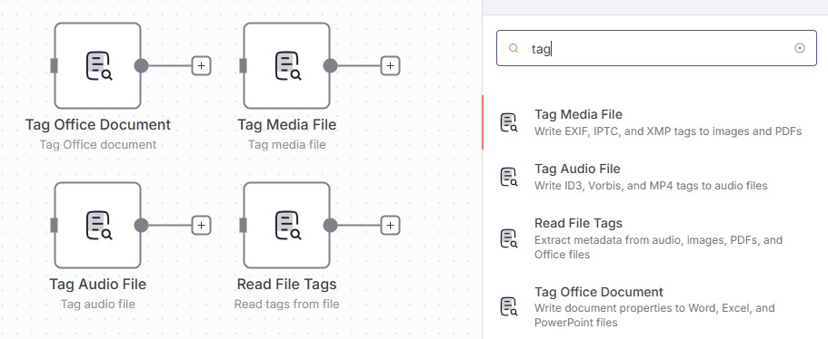

# n8n-nodes-tag-media

This is an n8n community node. It lets you read and write metadata tags to media files in your n8n workflows.

These nodes enable embedding metadata into audio files, images, PDFs, and Office documents - useful for digital asset management, media libraries, automated file organization, and content workflows.

[n8n](https://n8n.io/) is a [fair-code licensed](https://docs.n8n.io/reference/license/) workflow automation platform.

[Installation](#installation)
[Operations](#operations)
[Compatibility](#compatibility)
[Usage](#usage)
[Resources](#resources)

## Installation

Follow the [installation guide](https://docs.n8n.io/integrations/community-nodes/installation/) in the n8n community nodes documentation.

### Additional Requirements

This package requires external tools for certain operations:

| Node | Requirement |
|------|-------------|
| Tag Audio File | Python 3 + [mutagen](https://mutagen.readthedocs.io/) |
| Tag Media File | [exiftool](https://exiftool.org/) |
| Tag Office Document | Python 3 + [python-docx](https://python-docx.readthedocs.io/), [openpyxl](https://openpyxl.readthedocs.io/), [python-pptx](https://python-pptx.readthedocs.io/) |
| Read File Tags | [exiftool](https://exiftool.org/) |

#### Docker Installation (Recommended)

Add to your n8n Dockerfile:

```dockerfile
# Install system dependencies
RUN apk add --no-cache python3 py3-pip exiftool

# Install Python packages
RUN pip3 install --break-system-packages mutagen python-docx openpyxl python-pptx

# Install the node package
RUN cd /usr/local/lib/node_modules/n8n && \
    npm install n8n-nodes-tag-media
```

#### Manual Installation

1. Install system dependencies:
   ```bash
   # Debian/Ubuntu
   apt-get install python3 python3-pip libimage-exiftool-perl

   # Alpine
   apk add python3 py3-pip exiftool

   # macOS
   brew install python exiftool
   ```

2. Install Python packages:
   ```bash
   pip3 install mutagen python-docx openpyxl python-pptx
   ```

3. Install the node package:
   ```bash
   cd ~/.n8n/nodes
   npm install n8n-nodes-tag-media
   ```

4. Restart n8n

## Operations



### Tag Audio File

Write metadata tags to audio files using ID3, Vorbis Comments, and MP4 atoms.

**Supported file types:**

| Format | Tag Standard | Extension |
|--------|--------------|-----------|
| WAV | RIFF INFO + ID3v2.3 | `.wav` |
| MP3 | ID3v2.3 | `.mp3` |
| FLAC | Vorbis Comments | `.flac` |
| M4A/AAC | iTunes-style MP4 atoms | `.m4a`, `.aac` |
| OGG | Vorbis Comments | `.ogg` |

**Standard fields:** Title, Artist, Album Artist, Album, Year, Genre, Track Number, Disc Number, Composer, BPM, Copyright, Publisher, Comment, Lyrics

**Extended properties:** Additional metadata fields with dropdown selection for format-specific tags. See the [Mp3tag field mapping reference](https://docs.mp3tag.de/mapping/) for format compatibility.

---

### Tag Media File

Write EXIF, IPTC, and XMP metadata to images and documents using exiftool.

**Supported file types:**

| Format | Tag Standards | Extension |
|--------|---------------|-----------|
| JPEG | EXIF, IPTC, XMP | `.jpg`, `.jpeg` |
| PNG | XMP, IPTC | `.png` |
| TIFF | EXIF, IPTC, XMP | `.tiff`, `.tif` |
| PDF | XMP, PDF Info | `.pdf` |
| WebP | EXIF, XMP | `.webp` |
| GIF | XMP | `.gif` |

**Standard fields:** Title, Creator, Description, Copyright, Keywords

**Extended properties:** Dropdown selection for hundreds of EXIF, IPTC, XMP, PDF, and GPS tags, or specify custom exiftool tag names.

---

### Tag Office Document

Write document properties to Microsoft Office files.

**Supported file types:**

| Format | Description | Extension |
|--------|-------------|-----------|
| Word | Microsoft Word documents | `.docx` |
| Excel | Microsoft Excel spreadsheets | `.xlsx` |
| PowerPoint | Microsoft PowerPoint presentations | `.pptx` |

**Standard fields:** Title, Subject, Author, Description, Keywords, Category

**Extended properties:** Additional document properties like Manager, Company, Version, and custom properties.

---

### Read File Tags

Read embedded metadata from any supported file type using exiftool.

**Supported file types:** All formats supported by [exiftool](https://exiftool.org/#supported), including audio, images, video, documents, and more.

**Output options:**
- Include all fields
- Include only specific fields
- Exclude specific fields

## Compatibility

- **Minimum n8n version:** `1.111.0`
- **Tested with:** n8n `1.111.0`

### Platform Notes

- **Docker:** Recommended for easiest setup of Python and exiftool dependencies
- **Windows:** Requires Python and exiftool installed and available in PATH
- **Linux/macOS:** Install dependencies via package manager

## Usage

### Basic Workflow

1. Use a trigger or file input node to get your file
2. Connect to a Tag node to write metadata
3. The node outputs the modified file as binary data
4. Save or process the file further in your workflow

### Example: Tag Audio Files from Database

```
[Database Trigger] → [HTTP Request (download file)] → [Tag Audio File] → [S3 Upload]
```

### Example: Add Copyright to Images

```
[Watch Folder] → [Tag Media File (add copyright)] → [Move File]
```

### Extended Properties

All tag nodes support extended properties for format-specific metadata:

1. Enable "Extended Properties" in the node settings
2. Click "Add Property"
3. Select a field from the dropdown or choose "Custom" to enter any tag name
4. Enter the value (supports expressions)

## Resources

* [n8n community nodes documentation](https://docs.n8n.io/integrations/#community-nodes)
* [exiftool documentation](https://exiftool.org/)
* [mutagen documentation](https://mutagen.readthedocs.io/)
* [Mp3tag field mapping](https://docs.mp3tag.de/mapping/)

---

## Development

### Prerequisites

- [Docker](https://docs.docker.com/get-docker/) and Docker Compose
- Node.js v22+
- npm

### Quick Start

```bash
# Install dependencies
npm install

# Build and start n8n with the custom nodes
npm run dev:docker
```

Then open http://localhost:5678 in your browser.

### Available Scripts

| Script | Description |
|--------|-------------|
| `npm run build` | Compile TypeScript to JavaScript |
| `npm run dev:docker` | Build and start n8n in Docker with custom nodes |
| `npm run dev:docker:down` | Stop the Docker containers |
| `npm run dev:docker:logs` | View container logs |
| `npm run dev:docker:rebuild` | Rebuild and restart containers |
| `npm run lint` | Check code for errors |
| `npm run lint:fix` | Auto-fix linting issues |
| `npm test` | Run tests |

### Development Workflow

1. Make changes to TypeScript files in `nodes/` or Python scripts in `scripts/`
2. Run `npm run build` to compile
3. Run `npm run dev:docker:rebuild` to restart n8n with your changes
4. Test in the n8n web UI at http://localhost:5678

## License

[MIT](LICENSE.md)
